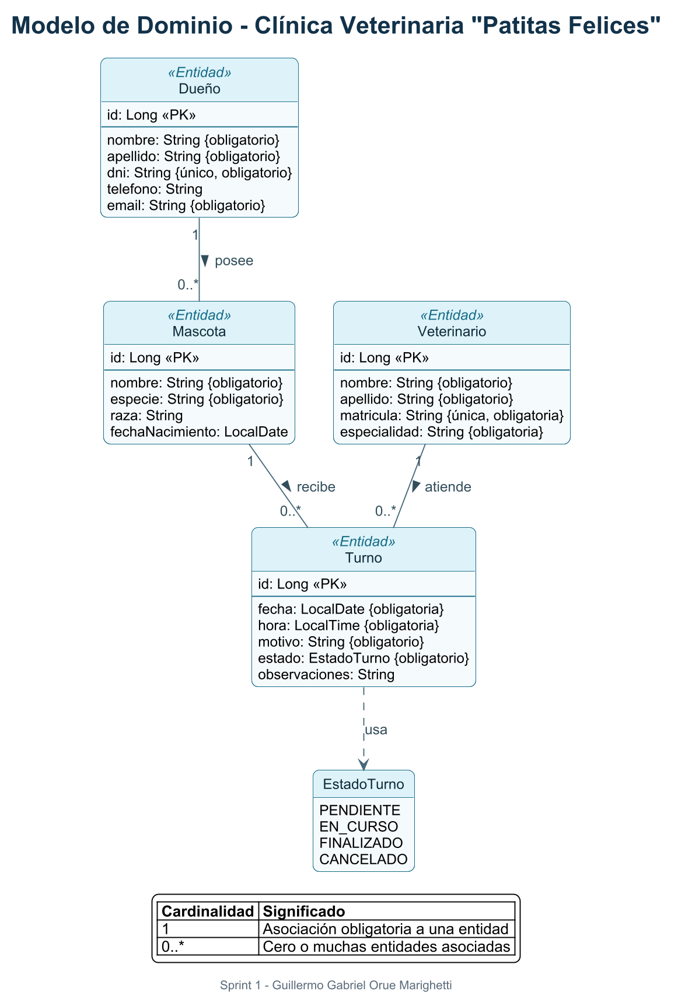

# VetSystem - Clínica Veterinaria Patitas Felices

Sistema de gestión para la Clínica Veterinaria **Patitas Felices**, desarrollado como trabajo práctico de la materia Microservicios y APIs Escalables de la Universidad de Palermo.

## Integrante

- Guillermo Gabriel Orue Marighetti

## Cómo levantar el proyecto

### Requisitos

- Java 21
- No es necesario instalar Maven: el repositorio incluye Maven Wrapper.
- No es necesario instalar un servidor de base de datos: se utiliza H2 en memoria.

La base de datos se crea al iniciar la aplicación y se elimina al detenerla.

En Windows PowerShell:

```powershell
.\mvnw.cmd spring-boot:run
```

En Linux o macOS:

```bash
./mvnw spring-boot:run
```

La aplicación quedará disponible en `http://localhost:8080`.

### Consola H2

La consola solo está disponible con el perfil `dev`. Para iniciar la aplicación con ese perfil:

En Windows PowerShell:

```powershell
.\mvnw.cmd spring-boot:run "-Dspring-boot.run.profiles=dev"
```

En Linux o macOS:

```bash
./mvnw spring-boot:run -Dspring-boot.run.profiles=dev
```

Luego, abrir `http://localhost:8080/h2-console` y usar:

- JDBC URL: `jdbc:h2:mem:vet_system`
- Usuario: `sa`
- Contraseña: dejar vacía

Sin el perfil `dev`, la consola H2 permanece deshabilitada.

Esto solo limita el acceso a la consola; la base de datos sigue siendo H2 en memoria en todos los perfiles.

> **Nota - Historia 3:** usamos H2 en memoria en lugar de MySQL. Es una configuración de desarrollo y los datos se reinician al detener la aplicación.

Para ejecutar las pruebas:

```powershell
.\mvnw.cmd test
```

## Documentación



- [Fuente PlantUML del diagrama](docs/diagrama-dominio.puml)
- [Evidencia de las tablas creadas en H2](docs/evidencia-tablas-h2.png)
- [Documentos PDF y DOCX de los sprints](docs/sprints/README.md)

## Ramas

- `main`: versión estable del proyecto.
- `sprint-01`: trabajo correspondiente al Sprint 1.
