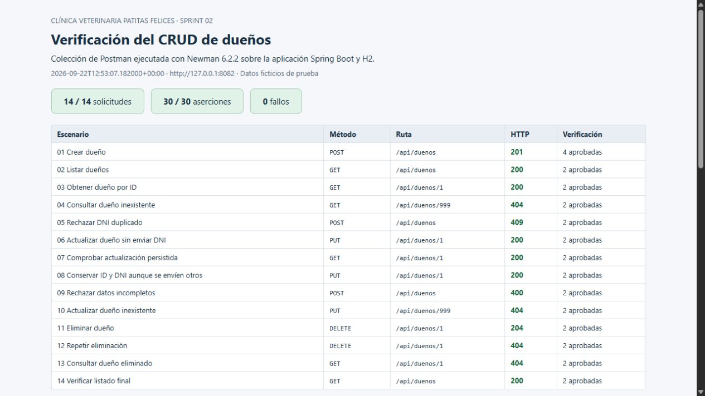

# Sprint 02 — API REST de dueños

El sprint agrega el CRUD de dueños con las capas Controller → Service → Repository. Conserva Spring Boot 4.1.0, Java 21 y H2 en memoria del sprint 01.

## Contrato HTTP

| Método | Ruta | Resultado |
| --- | --- | --- |
| GET | `/api/duenos` | 200 con una lista; `[]` si no hay dueños |
| GET | `/api/duenos/{id}` | 200 con el dueño o 404 |
| POST | `/api/duenos` | 201 con el dueño y cabecera `Location`; 409 si el DNI existe |
| PUT | `/api/duenos/{id}` | 200 con el dueño actualizado o 404 |
| DELETE | `/api/duenos/{id}` | 204 sin cuerpo o 404 |

POST requiere `nombre`, `apellido`, `dni` y `email`. PUT requiere `nombre`, `apellido` y `email`; `telefono` es opcional y omitirlo lo deja en `null`. Los campos de texto admiten hasta 255 caracteres y se guardan sin espacios en los extremos. Los campos obligatorios ausentes o en blanco retornan 400. La validación de formato de email y las validaciones mediante Bean Validation corresponden al sprint 05.

El servidor genera el ID al crear, incluso si se envía uno en el cuerpo. En PUT se utiliza el ID de la URL y se conserva el DNI original, aunque se envíe otro. La relación `mascotas` no se recibe ni se serializa en esta API: evita altas anidadas involuntarias y ciclos JSON. Su API y las reglas de las relaciones se desarrollan en el sprint 03; el mapeo JPA de cascada existente no se modifica.

Las excepciones de dominio se traducen en el controlador a un mensaje JSON, por ejemplo:

```json
{"mensaje": "Dueño con id 999 no fue encontrado"}
```

```json
{"mensaje": "Ya existe un dueño con DNI: 28543210"}
```

`DuenoRepository` incluye `existsByDni(String dni)` y `findByEmail(String email)`. El servicio controla el DNI antes del alta y también convierte a 409 la colisión de la restricción única si dos altas compiten. Las actualizaciones y eliminaciones se ejecutan dentro de una transacción.

## Ejemplo de alta

Enviar `POST http://localhost:8080/api/duenos` con `Content-Type: application/json`:

```json
{
  "nombre": "Carlos",
  "apellido": "González",
  "dni": "28543210",
  "telefono": "1145678901",
  "email": "carlos.gonzalez@example.com"
}
```

Los datos de la colección son ficticios y sirven exclusivamente para las pruebas.

## Ejecutar la colección en Postman

1. Iniciar una instancia local con H2 vacía siguiendo el [README](../README.md).
2. Importar [VetSystem_Sprint_02.postman_collection.json](VetSystem_Sprint_02.postman_collection.json).
3. Mantener la variable `baseUrl` en `http://localhost:8080`, o cambiarla al puerto elegido. Si hay una variable de entorno `baseUrl` activa en Postman, tiene precedencia sobre la de la colección.
4. Ejecutar los 14 pedidos, en orden, con el Collection Runner. El primero guarda `duenoId` automáticamente. `dni` debe estar libre y `missingId` (por defecto 999) debe ser inexistente.
5. Verificar **30 aserciones aprobadas y 0 fallos**. La colección elimina únicamente el dueño que acaba de crear; también verifica un segundo borrado y una consulta posterior con 404.

Cada pedido incluye una respuesta de ejemplo guardada a partir de la ejecución real de Newman. Si una ejecución queda interrumpida después del alta, reiniciar la instancia local de H2 o usar otro `dni` antes de repetir la colección.

## Repetir las pruebas por consola

La colección se verificó con **Newman 6.2.2**, el ejecutor de colecciones de Postman. No se utilizó la interfaz gráfica de Postman. Las capturas adjuntas corresponden al informe de esa ejecución; la colección queda disponible para importarla y ejecutar también las pruebas manuales.

Con la aplicación iniciada y Node.js/npm disponibles:

```powershell
npx --yes newman@6.2.2 run docs/VetSystem_Sprint_02.postman_collection.json
```

Para elegir otro puerto y guardar los resultados:

```powershell
npx --yes newman@6.2.2 run docs/VetSystem_Sprint_02.postman_collection.json --env-var baseUrl=http://127.0.0.1:8082 --reporters cli,json --reporter-json-export target/sprint-02-newman.json
```

Referencia: [documentación oficial de los informes de Newman](https://learning.postman.com/docs/reference/newman-cli/newman-built-in-reporters).

## Evidencia de verificación

Verificación realizada el 22 de septiembre de 2026:

- `mvnw.cmd verify`: **18 pruebas, 0 fallos, 0 errores** y JAR generado.
- Colección Postman con Newman: **14 solicitudes, 30 aserciones, 0 fallos**, sobre la aplicación real en `127.0.0.1:8082`.
- La integración cubre persistencia, consulta por email, lista vacía, DNI duplicado, ocho altas concurrentes, DNI e ID inmutables al editar, entradas inválidas, eliminación y dueños inexistentes. También comprueba que un dueño con mascotas pueda consultarse sin serialización circular.

Archivos de evidencia:

- [Salida de Newman](evidencias/sprint-02/newman.txt).
- [Solicitudes, respuestas y aserciones en JSON](evidencias/sprint-02/resultados.json).
- [Informe HTML con el detalle de cada operación](evidencias/sprint-02/informe.html).
- [Captura de las respuestas 404 y 409](evidencias/sprint-02/errores.png).



## Nota del entorno Windows

En el entorno de verificación, Java 21.0.10 no pudo crear una conexión interna de Tomcat usando el directorio temporal predeterminado de Windows (`Unable to establish loopback connection`). La ejecución se resolvió indicando un directorio temporal existente dentro del proyecto, sin cambiar la aplicación ni la configuración del sistema:

```powershell
New-Item -ItemType Directory -Force target/java-tmp | Out-Null
java "-Djdk.net.unixdomain.tmpdir=$((Resolve-Path target/java-tmp).Path)" -jar target/vet-system-0.0.1-SNAPSHOT.jar --server.address=127.0.0.1 --server.port=8082
```

Es una opción para ese error específico del entorno. La ejecución normal sigue siendo la del README. La propiedad se encuentra documentada en [Java Networking de Oracle](https://docs.oracle.com/en/java/javase/17/core/java-networking.html).
